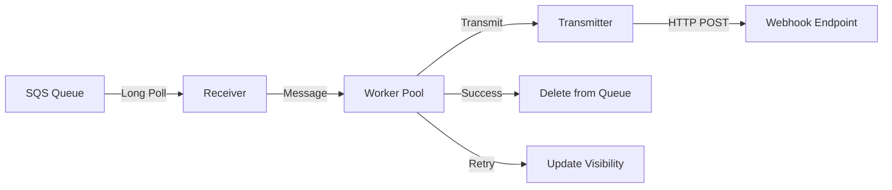

## High-Level Architecture

Carrier is built on a modular architecture that cleanly separates **message receiving** from **message transmission**. This separation of concerns enables:

- Independent scaling of receivers and transmitters
- Easy addition of new message queue types
- Flexible output destinations
- Concurrent processing for high throughput

## Core Components

<CardGroup cols={2}>
  <Card title="Receivers" icon="inbox" href="/architecture/receivers">
    Read messages from message queues (currently SQS)
  </Card>
  <Card title="Transmitters" icon="paper-plane" href="/architecture/transmitters">
    Send messages to destinations (currently HTTP webhooks)
  </Card>
</CardGroup>

## Message Flow

The following diagram illustrates how messages flow through Carrier:



### Processing Steps

1. **Receive**: Receivers poll message queues using long polling (20s wait time)
2. **Distribute**: Messages are sent to a pool of concurrent workers
3. **Transmit**: Each worker transmits the message via the configured transmitter
4. **Acknowledge**: Successfully transmitted messages are deleted from the queue
5. **Retry**: Failed messages with retryable errors have their visibility timeout updated

## Concurrency Model

Carrier uses a multi-level concurrency architecture for high throughput:

### Receiver Level

```go
for range envCfg.SQSReceivers {
    receiver := sqs.NewReceiver(&sqs.ReceiverConfig{
        // ... config
    })
    p.Run(receiver.Rx)
}
```

Multiple receiver goroutines can run in parallel, each polling the same queue independently. This is configured via `SQS_RECEIVERS`.

### Worker Level

Each receiver maintains its own pool of workers:

```go
for range workers {
    h := newHandler(&handlerConfig{
        Transmitter: c.Transmitter,
        Ctx:         ctx,
        Work:        messages,
        Results:     results,
    })
    p.Run(h.handleMessages)
}
```

Workers process messages concurrently within each receiver. This is configured via `SQS_RECEIVER_WORKERS`.

### Batch Processing

Receivers fetch messages in batches from SQS:

```go
res, err := p.client.ReceiveMessage(p.ctx, &sqs.ReceiveMessageInput{
    QueueUrl:            &p.queueURL,
    MaxNumberOfMessages: p.batchSize,
    WaitTimeSeconds:     20,
    // ...
})
```

Batch size is configured via `SQS_BATCH_SIZE`.

<Info>
**Performance Tuning**: Total concurrent message processing = `SQS_RECEIVERS × SQS_RECEIVER_WORKERS × SQS_BATCH_SIZE`
</Info>

## Separation of Concerns

### Receivers

Receivers are responsible for:
- Polling message queues
- Managing message visibility
- Handling acknowledgments and deletions
- Retry logic for failed transmissions

**Interface Contract**:
```go
type Transmitter interface {
    Tx(io.Reader, transmitter.TransmitAttributes) error
}
```

Receivers only need a `Transmitter` interface - they don't care about the destination.

### Transmitters

Transmitters are responsible for:
- Delivering messages to destinations
- Setting appropriate headers/metadata
- TLS/security configuration
- Handling destination-specific errors

**Implementation**: From `receiver/sqs/sqs.go:60-62`
```go
type Transmitter interface {
    Tx(io.Reader, transmitter.TransmitAttributes) error
}
```

## Extensibility

### Adding New Receivers

To add support for a new message queue (e.g., RabbitMQ, Kafka):

1. Implement the receiver logic in a new package (e.g., `receiver/rabbitmq`)
2. Use the same `Transmitter` interface
3. Follow the same pattern: poll → distribute → transmit → acknowledge

### Adding New Transmitters

To add support for new destinations (e.g., gRPC, SNS):

1. Create a new transmitter package (e.g., `transmitter/grpc`)
2. Implement the `Tx(io.Reader, transmitter.TransmitAttributes) error` method
3. Configure it in `main.go` instead of the webhook transmitter

## Error Handling

Carrier distinguishes between retryable and non-retryable errors:

### Retryable Errors

```go
type TransmitRetryableError struct {
    Err        error
    RetryAfter time.Duration
}
```

When a transmitter returns a retryable error (e.g., HTTP 429), the receiver updates the message visibility timeout:

```go
if errors.As(r.err, &err) {
    retryEntries = append(retryEntries, types.ChangeMessageVisibilityBatchRequestEntry{
        Id:                r.MessageID,
        ReceiptHandle:     r.ReceiptHandle,
        VisibilityTimeout: int32(err.RetryAfter.Seconds()),
    })
}
```

### Non-Retryable Errors

Non-retryable errors are logged but the message remains in the queue until it expires or reaches the dead-letter queue.

## Health Monitoring

Carrier includes optional webhook health checking:

```go
checker := webhook.NewHealthChecker(&webhook.HealthCheckerConfig{
    LogHandler:            logHandler,
    WebhookEndpoint:       envCfg.WebhookEndpoint,
    HealthCheckEndpoint:   envCfg.WebhookHealthCheckEndpoint,
    Interval:              envCfg.WebhookHealthCheckInterval,
    Timeout:               envCfg.WebhookHealthCheckTimeout,
    OfflineThresholdCount: envCfg.WebhookOfflineThresholdCount,
    // ...
})
```

If the webhook becomes unavailable, Carrier can gracefully shut down to prevent message loss.

## Resource Management

Carrier uses the `probe/pool` library for goroutine management:

```go
p := pool.NewPool(&pool.PoolConfig{
    LogHandler: logHandler,
    Ctx:        ctx,
    Size:       size,
})
```

All goroutines are tracked and can be gracefully stopped:

```go
cancel()
p.Stop(true)
```
